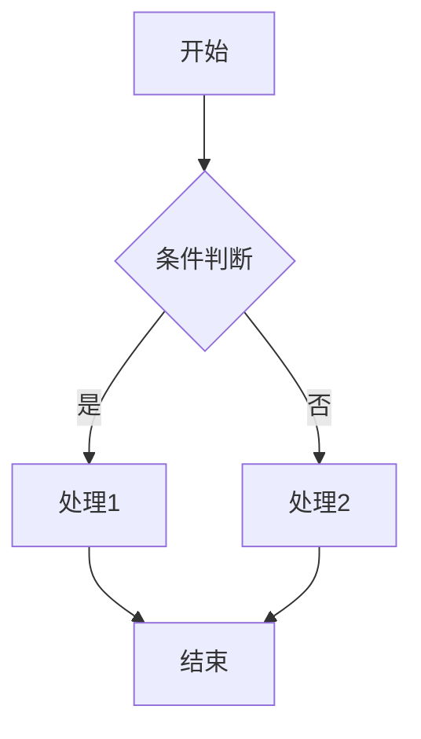
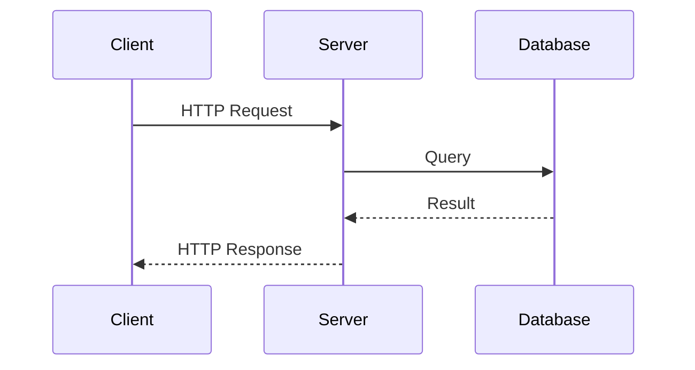
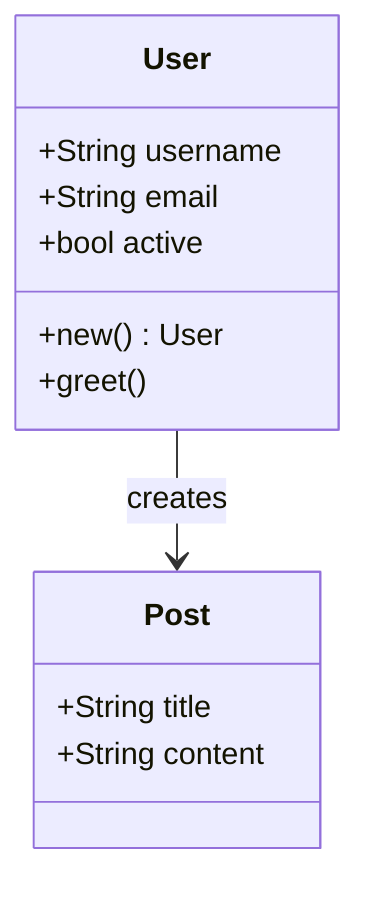
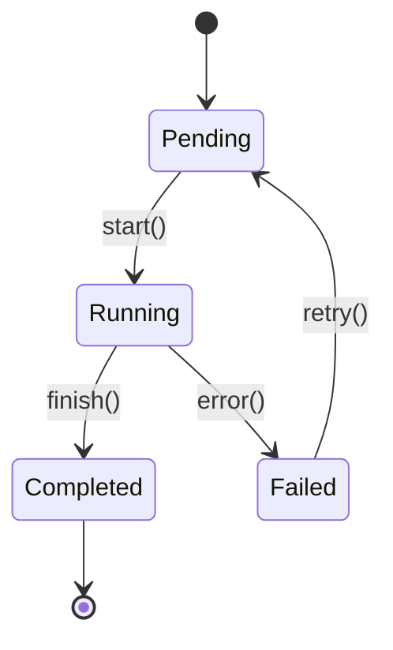
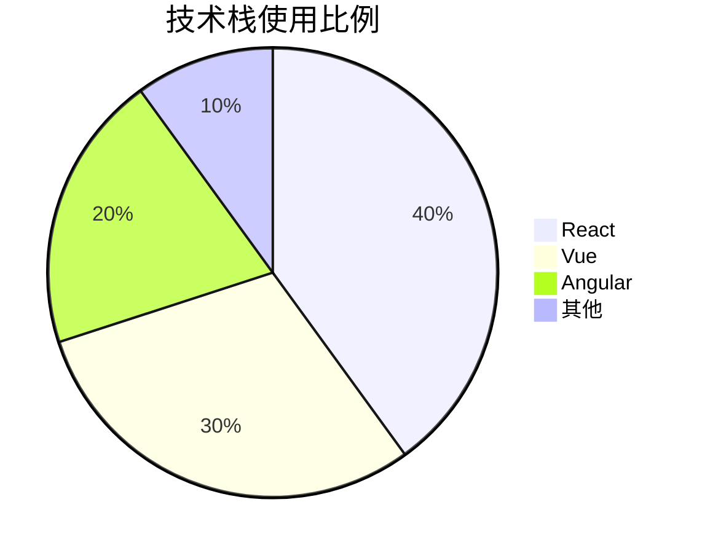
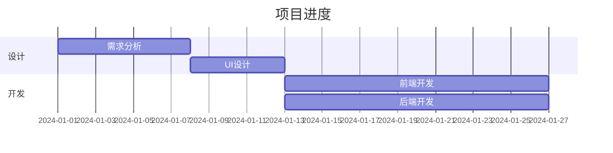

# JasBlog 博客写作指南

本指南帮助你快速上手博客内容创作。

---

## 目录结构

```
content/
├── notes/          # 学习笔记 (Markdown)
├── projects/       # 开源项目 (Markdown)
├── roadmaps/       # 规划文档 (Markdown)
└── graphs/         # 知识图谱 (JSON)
```

---

## 一、学习笔记 (Notes)

### 文件位置
`content/notes/` 目录下创建 `.md` 文件

### 文件命名
使用英文小写 + 短横线，如 `react-hooks.md`、`typescript-basics.md`

### 基本模板

```markdown
---
title: 文章标题
date: 2026-02-03
excerpt: 文章摘要，会显示在列表页
tags:
  - 标签1
  - 标签2
---

正文内容从这里开始...
```

### Frontmatter 字段说明

| 字段 | 必填 | 说明 |
|------|------|------|
| `title` | 是 | 文章标题 |
| `date` | 是 | 发布日期，格式 `YYYY-MM-DD` |
| `excerpt` | 是 | 摘要，显示在文章列表 |
| `tags` | 否 | 标签数组，用于分类筛选 |

---

## 二、Markdown 语法大全

### 1. 标题

```markdown
# 一级标题 (页面标题，一般不用)
## 二级标题 (章节标题)
### 三级标题 (小节标题)
#### 四级标题
##### 五级标题
###### 六级标题
```

**特性**：标题会自动生成锚点链接，鼠标悬停时显示 `#` 符号，点击可跳转和复制链接。

---

### 2. 段落与换行

```markdown
这是第一段。

这是第二段。(空一行表示新段落)

这是强制换行
末尾加两个空格

或者使用 <br> 标签换行
```

---

### 3. 文字样式

```markdown
**粗体文字**
*斜体文字*
***粗斜体***
~~删除线~~
`行内代码`
```

效果：
- **粗体文字**
- *斜体文字*
- ***粗斜体***
- ~~删除线~~
- `行内代码`

---

### 4. 列表

**无序列表：**
```markdown
- 项目一
- 项目二
  - 子项目 (缩进两个空格)
  - 子项目
- 项目三
```

**有序列表：**
```markdown
1. 第一步
2. 第二步
3. 第三步
```

**任务列表：**
```markdown
- [x] 已完成
- [ ] 未完成
```

效果：
- [x] 已完成
- [ ] 未完成

---

### 5. 链接与图片

**链接：**
```markdown
[链接文字](https://example.com)
[带标题的链接](https://example.com "鼠标悬停显示")
```

外部链接会自动在新标签页打开。

**图片：**
```markdown


```

**特性**：点击图片可放大查看，再次点击或点击背景关闭。

---

### 6. 引用

```markdown
> 这是引用文字
> 可以多行
>
> > 嵌套引用
```

效果：
> 这是引用文字
> 可以多行
>
> > 嵌套引用

---

### 7. GitHub 风格提示框 (Alert)

支持 5 种提示框类型：

```markdown
> [!NOTE]
> 这是一条笔记提示，用于补充信息。

> [!TIP]
> 这是一条技巧提示，帮助用户更好地使用。

> [!IMPORTANT]
> 这是重要信息，用户需要特别注意。

> [!WARNING]
> 这是警告信息，可能会导致问题。

> [!CAUTION]
> 这是危险警告，可能导致严重后果。
```

效果展示：

| 类型 | 用途 | 颜色 |
|------|------|------|
| `NOTE` | 补充说明 | 蓝色 |
| `TIP` | 使用技巧 | 绿色 |
| `IMPORTANT` | 重要信息 | 紫色 |
| `WARNING` | 警告信息 | 橙色 |
| `CAUTION` | 危险警告 | 红色 |

---

### 8. 代码块

**行内代码：**
```markdown
使用 `console.log()` 输出
```

**代码块（指定语言高亮）：**

````markdown
```javascript
function hello() {
  console.log("Hello World");
}
```
````

**特性**：
- 代码块左上角自动显示语言标签
- 鼠标悬停时显示复制按钮，点击可复制代码

**常用语言标识：**
- `javascript` / `js`
- `typescript` / `ts`
- `python`
- `rust`
- `java`
- `html`
- `css`
- `bash` / `shell`
- `json`
- `markdown`

---

### 9. 表格

```markdown
| 左对齐 | 居中对齐 | 右对齐 |
|:-------|:--------:|-------:|
| 内容1  | 内容2    | 内容3  |
| 内容4  | 内容5    | 内容6  |
```

效果：

| 左对齐 | 居中对齐 | 右对齐 |
|:-------|:--------:|-------:|
| 内容1  | 内容2    | 内容3  |
| 内容4  | 内容5    | 内容6  |

---

### 10. 分隔线

```markdown
---
***
___
```

三种写法效果相同，产生一条水平线。

---

### 11. 转义字符

如果要显示 Markdown 特殊字符本身，使用反斜杠转义：

```markdown
\*这不是斜体\*
\# 这不是标题
\[这不是链接\]
```

---

## 三、数学公式 (LaTeX)

博客支持 KaTeX 渲染 LaTeX 数学公式。

### 行内公式

使用单个美元符号 `$...$` 包裹：

```markdown
欧拉公式 $e^{i\pi} + 1 = 0$ 被认为是数学中最美丽的公式。

时间复杂度通常表示为 $O(n \log n)$ 或 $O(n^2)$。
```

### 块级公式

使用双美元符号 `$$...$$` 包裹（独占一行）：

```markdown
二次方程求根公式：

$$
x = \frac{-b \pm \sqrt{b^2 - 4ac}}{2a}
$$
```

### 常用 LaTeX 语法

| 语法 | 效果 | 说明 |
|------|------|------|
| `x^2` | x² | 上标 |
| `x_i` | xᵢ | 下标 |
| `\frac{a}{b}` | a/b | 分数 |
| `\sqrt{x}` | √x | 平方根 |
| `\sum_{i=1}^{n}` | 求和 | 求和符号 |
| `\int_a^b` | 积分 | 积分符号 |
| `\alpha, \beta, \gamma` | α, β, γ | 希腊字母 |
| `\rightarrow` | → | 箭头 |
| `\leq, \geq` | ≤, ≥ | 比较符号 |
| `\infty` | ∞ | 无穷大 |

### 矩阵

```markdown
$$
\begin{bmatrix}
a & b \\
c & d
\end{bmatrix}
$$
```

### 分段函数

```markdown
$$
f(x) = \begin{cases}
x & \text{if } x \geq 0 \\
-x & \text{if } x < 0
\end{cases}
$$
```

---

## 四、Mermaid 图表

博客支持 Mermaid 语法绘制多种图表。

### 流程图 (Flowchart)

````markdown

````

**节点形状：**
- `[文字]` - 矩形
- `(文字)` - 圆角矩形
- `{文字}` - 菱形（判断）
- `((文字))` - 圆形
- `[[文字]]` - 子程序

**方向：**
- `TD` / `TB` - 从上到下
- `BT` - 从下到上
- `LR` - 从左到右
- `RL` - 从右到左

### 时序图 (Sequence Diagram)

````markdown

````

**箭头类型：**
- `->` - 实线
- `-->` - 虚线
- `->>` - 实线带箭头
- `-->>` - 虚线带箭头

### 类图 (Class Diagram)

````markdown

````

### 状态图 (State Diagram)

````markdown

````

### 饼图 (Pie Chart)

````markdown

````

### 甘特图 (Gantt Chart)

````markdown

````

---

## 五、知识图谱嵌入

在文章中嵌入知识图谱，使用特殊代码块：

````markdown
```graph
{
  "nodes": [
    {
      "id": "node1",
      "position": { "x": 0, "y": 0 },
      "data": {
        "label": "节点名称",
        "color": "blue",
        "tags": ["标签1", "标签2"],
        "content": "节点详细描述"
      }
    },
    {
      "id": "node2",
      "position": { "x": 200, "y": 100 },
      "data": {
        "label": "另一个节点",
        "color": "green"
      }
    }
  ],
  "edges": [
    {
      "id": "e1",
      "source": "node1",
      "target": "node2",
      "label": "关系说明"
    }
  ]
}
```
````

### 节点属性

| 属性 | 必填 | 说明 |
|------|------|------|
| `id` | 是 | 唯一标识 |
| `position.x` | 是 | X 坐标 |
| `position.y` | 是 | Y 坐标 |
| `data.label` | 是 | 节点标题 |
| `data.color` | 否 | 颜色：`red`, `orange`, `yellow`, `green`, `blue`, `purple`, `pink`, `default` |
| `data.tags` | 否 | 标签数组 |
| `data.content` | 否 | 详细内容（点击节点显示） |

### 边属性

| 属性 | 必填 | 说明 |
|------|------|------|
| `id` | 是 | 唯一标识 |
| `source` | 是 | 起始节点 ID |
| `target` | 是 | 目标节点 ID |
| `label` | 否 | 边上的文字说明 |

---

## 六、开源项目 (Projects)

### 文件位置
`content/projects/` 目录下创建 `.md` 文件

### 基本模板

```markdown
---
title: 项目名称
description: 项目简介
github: https://github.com/username/repo
tags:
  - React
  - TypeScript
techStack:
  - name: React
    icon: react
  - name: Node.js
    icon: nodejs
status: active
---

## 项目介绍

详细介绍...

## 功能特点

- 功能一
- 功能二

## 快速开始

安装和使用说明...
```

### Frontmatter 字段说明

| 字段 | 必填 | 说明 |
|------|------|------|
| `title` | 是 | 项目名称 |
| `description` | 是 | 简短描述 |
| `github` | 是 | GitHub 仓库地址 |
| `tags` | 否 | 技术标签 |
| `techStack` | 否 | 技术栈（带图标） |
| `status` | 否 | 状态：`active`/`archived`/`wip` |

---

## 七、规划文档 (Roadmaps)

### 文件位置
`content/roadmaps/` 目录下创建 `.md` 文件

### 基本模板

```markdown
---
title: 规划名称
description: 规划描述
items:
  - title: 已完成的任务
    status: completed
    description: 任务描述
  - title: 进行中的任务
    status: in-progress
    description: 任务描述
  - title: 计划中的任务
    status: planned
    description: 任务描述
---

## 规划详情

这里可以写更多详细说明...
```

### 任务状态

| 状态 | 说明 |
|------|------|
| `completed` | 已完成 |
| `in-progress` | 进行中 |
| `planned` | 计划中 |

---

## 八、独立知识图谱页面

### 文件位置
`content/graphs/` 目录下创建 `.json` 文件

### 基本模板

```json
{
  "name": "图谱名称",
  "description": "图谱描述",
  "nodes": [
    {
      "id": "1",
      "position": { "x": 0, "y": 0 },
      "data": {
        "label": "节点1",
        "color": "red",
        "tags": ["核心"],
        "content": "详细说明"
      }
    }
  ],
  "edges": [
    {
      "id": "e1",
      "source": "1",
      "target": "2"
    }
  ]
}
```

### 从 GraphAndTable 导入

如果你使用 [GraphAndTable](https://github.com/GTJasonMK/GraphAndTable) 项目创建知识图谱，可以直接导入：

**方法一：手动导入**

1. 在 GraphAndTable 中导出图谱（菜单 - 导出 JSON）
2. 将导出的 `.json` 文件复制到 `content/graphs/` 目录
3. 编辑文件，在开头添加 `name` 和 `description` 字段：

```json
{
  "name": "图谱名称",
  "description": "图谱描述",
  "nodes": [...],
  "edges": [...]
}
```

4. 重命名文件为英文 slug 格式，如 `react-learning.json`

**方法二：使用导入脚本**

```bash
# 1. 将导出的 JSON 文件放到 content/graphs/ 目录
# 2. 运行导入脚本
node scripts/import-graph.js graph_1234567890.json "图谱名称" "图谱描述"
```

脚本会自动：
- 添加 name 和 description 字段
- 生成正确的文件名
- 验证数据格式

---

## 九、写作建议

### 文章结构

1. **引言** - 简要说明主题和目的
2. **正文** - 分章节展开
3. **总结** - 概括要点

### 排版技巧

- 适当使用标题分层，不要跳级
- 代码块指定语言获得高亮
- 重要内容使用**粗体**强调
- 列表让内容更清晰
- 使用 Alert 提示框突出重要信息
- 数学公式使用 LaTeX 语法
- 流程和关系使用 Mermaid 图表

### SEO 建议

- 标题包含关键词
- 摘要简洁准确
- 标签选择常用词汇

---

## 十、本地预览

```bash
# 启动开发服务器
npm run dev

# 访问
http://localhost:3000
```

修改内容后自动刷新，即时预览效果。

---

## 十一、发布流程

1. 在 `content/` 目录下创建或修改文件
2. 本地预览确认无误
3. 提交并推送到 GitHub

```bash
git add .
git commit -m "添加新文章: 文章名称"
git push origin master
```

4. GitHub Actions 自动构建部署
5. 等待几分钟后访问网站查看

---

## 十二、功能特性速查表

| 功能 | 语法/操作 |
|------|----------|
| 标题锚点 | 鼠标悬停标题显示 `#`，点击跳转 |
| 代码复制 | 鼠标悬停代码块，点击 Copy 按钮 |
| 图片放大 | 点击图片放大，再点击关闭 |
| 行内数学公式 | `$公式$` |
| 块级数学公式 | `$$公式$$` |
| 提示框 | `> [!NOTE]` / `[!TIP]` / `[!IMPORTANT]` / `[!WARNING]` / `[!CAUTION]` |
| 流程图 | ` ```mermaid flowchart ``` ` |
| 时序图 | ` ```mermaid sequenceDiagram ``` ` |
| 类图 | ` ```mermaid classDiagram ``` ` |
| 状态图 | ` ```mermaid stateDiagram-v2 ``` ` |
| 知识图谱 | ` ```graph {...} ``` ` |

---

如有问题，请查阅项目 README 或提交 Issue。
