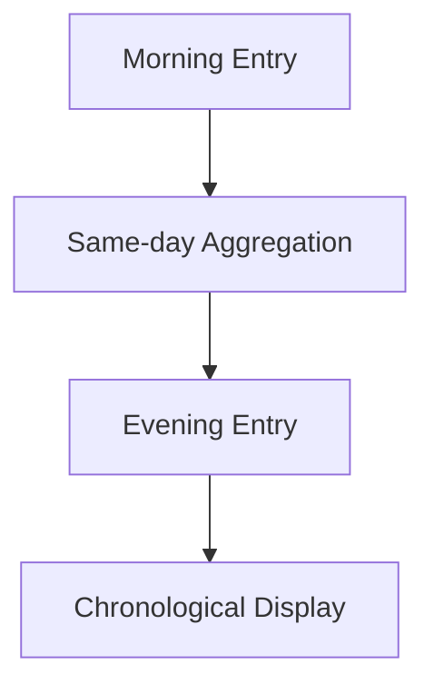

---
title: Evening Wrap-up
date: 2026-02-18
time: 21:30
excerpt: Second diary entry of the day, used to validate same-day aggregation and time ordering.
tags:
  - diary
  - showcase
  - evening
mood: calm
weather: sunny
location: home
companions:
  - pair review
---

## Evening Note

This entry should be aggregated with the morning one under `/diary/2026-02-18`.

> [!IMPORTANT]
> Multiple files on the same date should be merged into one diary day page.
