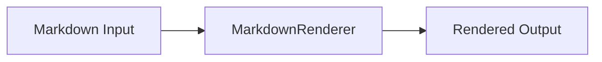

---
title: Rendering Showcase Note
date: 2026-02-18
excerpt: A single note that exercises tables, math, code highlighting, Mermaid, alerts, images, and embedded graph blocks.
tags:
  - showcase
  - markdown
  - graph
---

## Overview

This page is designed to verify `/notes` and `/notes/[slug]` rendering behavior.

- Bullet list item A
- Bullet list item B
- [x] GFM checklist done
- [ ] GFM checklist pending

### Table

| Feature | Status | Notes |
| --- | --- | --- |
| Heading anchors | Enabled | Heading hash links are shown on hover. |
| Code highlighting | Enabled | Powered by `rehype-highlight`. |
| Math rendering | Enabled | Powered by KaTeX. |

### Math

Inline equation: $E = mc^2$

Block equation:

$$
\int_0^1 x^2\,dx = \frac{1}{3}
$$

## Code Block

```ts
type RenderFeature = {
  name: string;
  enabled: boolean;
};

const features: RenderFeature[] = [
  { name: "table", enabled: true },
  { name: "math", enabled: true },
  { name: "mermaid", enabled: true },
  { name: "graph", enabled: true },
];

console.log(features.filter((f) => f.enabled).map((f) => f.name));
```

## Mermaid Diagram



## Alert

> [!TIP]
> Use this section to verify GitHub-style alert rendering.

## Image Zoom


## Embedded Graph Block

The `graph` block below should render as an interactive graph inside the article body.

```graph
{
  "nodes": [
    {
      "id": "n1",
      "position": { "x": 120, "y": 90 },
      "data": {
        "label": "Renderer",
        "tags": ["core", "flow"],
        "color": "blue",
        "edgeColor": "p2",
        "content": "<p>The markdown rendering entry point.</p>"
      }
    },
    {
      "id": "n2",
      "position": { "x": 380, "y": 90 },
      "data": {
        "label": "Output",
        "tags": ["result"],
        "color": "green",
        "edgeColor": "p4",
        "content": "<p>Final page output shown to users.</p>"
      }
    }
  ],
  "edges": [
    {
      "id": "e1",
      "source": "n1",
      "target": "n2",
      "label": "render"
    }
  ]
}
```

## Quick Check

1. Open `/notes` and confirm this card exists.
2. Open the detail page and verify TOC, math, Mermaid, alert, and image zoom.
3. Confirm the embedded `graph` block renders as an interactive graph component.
