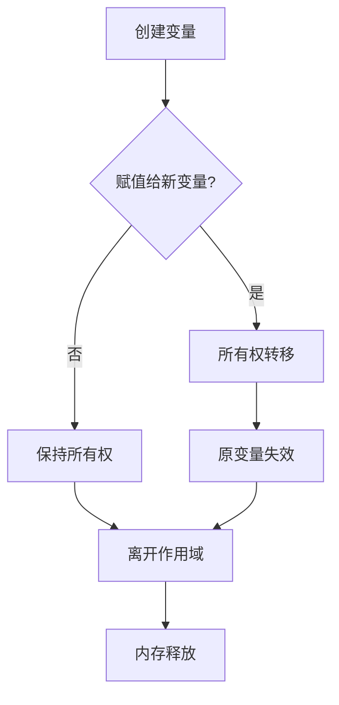
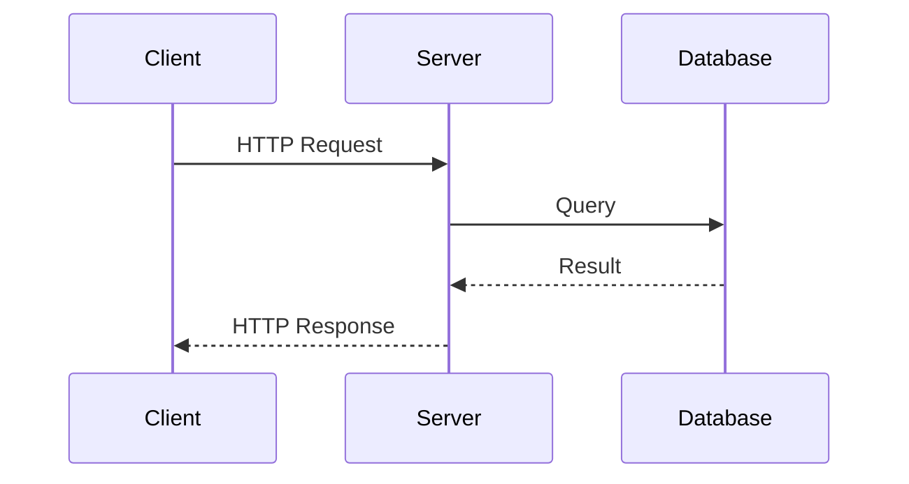
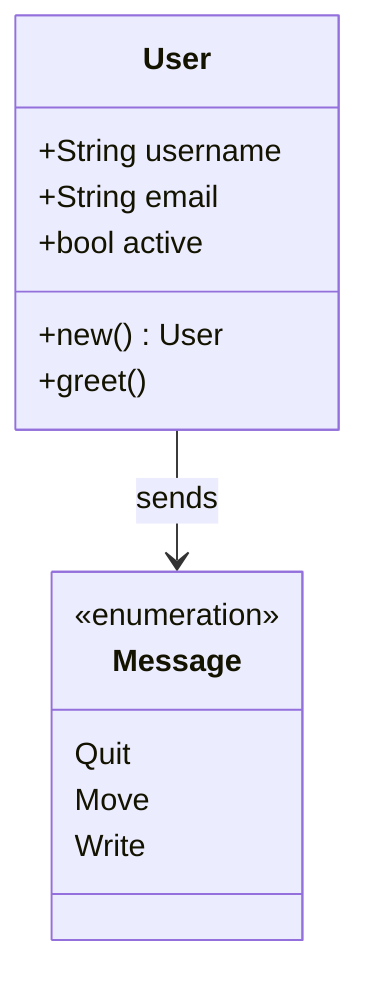
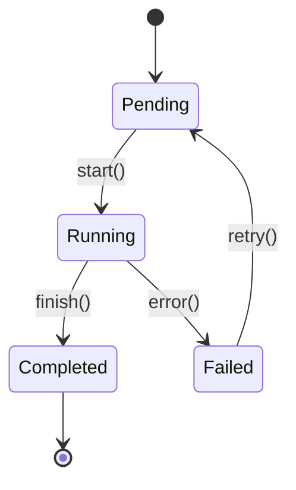

## 简介

Rust 是一门注重**安全性**、*并发性*和性能的系统编程语言。它由 Mozilla 研究院开发，现已成为最受欢迎的编程语言之一。

> [!NOTE]
> Rust 连续多年被 Stack Overflow 评为"最受喜爱的编程语言"。

---

## 基础语法

### 变量与常量

在 Rust 中，变量默认是**不可变的**。使用 `mut` 关键字声明可变变量：

```rust
fn main() {
    let x = 5;           // 不可变变量
    let mut y = 10;      // 可变变量
    const MAX: u32 = 100; // 常量

    y = 20; // 可以修改
    println!("x = {}, y = {}", x, y);
}
```

### 数据类型

Rust 是静态类型语言，常见数据类型包括：

| 类型 | 说明 | 示例 |
|------|------|------|
| `i32` | 32位有符号整数 | `let a: i32 = 42;` |
| `f64` | 64位浮点数 | `let b: f64 = 3.14;` |
| `bool` | 布尔值 | `let c: bool = true;` |
| `char` | Unicode 字符 | `let d: char = 'A';` |
| `String` | 字符串 | `let s = String::from("hello");` |

---

## 所有权系统

> [!IMPORTANT]
> 所有权是 Rust 最独特的特性，它使 Rust 无需垃圾回收器即可保证内存安全。

### 所有权流程图



### 所有权规则

1. Rust 中每个值都有一个**所有者**
2. 值在任一时刻只能有**一个所有者**
3. 当所有者离开作用域时，值会被**丢弃**

```rust
fn main() {
    let s1 = String::from("hello");
    let s2 = s1; // s1 的所有权移动到 s2

    // println!("{}", s1); // 编译错误！s1 不再有效
    println!("{}", s2); // 正确
}
```

> [!WARNING]
> 所有权转移后，原变量将不可用。尝试使用会导致编译错误。

---

## 数学公式示例

Rust 中的数值运算遵循标准数学规则。

### 行内公式

欧拉公式 $e^{i\pi} + 1 = 0$ 被认为是数学中最美丽的公式之一。

时间复杂度通常表示为 $O(n \log n)$ 或 $O(n^2)$。

### 块级公式

二次方程求根公式：

$$
x = \frac{-b \pm \sqrt{b^2 - 4ac}}{2a}
$$

高斯分布（正态分布）的概率密度函数：

$$
f(x) = \frac{1}{\sigma\sqrt{2\pi}} e^{-\frac{(x-\mu)^2}{2\sigma^2}}
$$

矩阵乘法：

$$
\begin{bmatrix}
a & b \\
c & d
\end{bmatrix}
\begin{bmatrix}
e & f \\
g & h
\end{bmatrix}
=
\begin{bmatrix}
ae+bg & af+bh \\
ce+dg & cf+dh
\end{bmatrix}
$$

---

## Mermaid 图表示例

### 时序图



### 类图



### 状态图



---

## 错误处理

> [!CAUTION]
> 不要滥用 `unwrap()`，在生产代码中应该正确处理错误。

Rust 使用 `Result` 和 `Option` 类型进行错误处理：

```rust
use std::fs::File;
use std::io::Read;

fn read_file(path: &str) -> Result<String, std::io::Error> {
    let mut file = File::open(path)?;
    let mut contents = String::new();
    file.read_to_string(&mut contents)?;
    Ok(contents)
}
```

---

## 学习计划

- [x] 完成基础语法学习
- [x] 理解所有权系统
- [ ] 学习生命周期
- [ ] 掌握智能指针
- [ ] 学习异步编程

## 参考资源

- [The Rust Programming Language](https://doc.rust-lang.org/book/) - 官方教程
- [Rust by Example](https://doc.rust-lang.org/rust-by-example/) - 示例学习
- [Rustlings](https://github.com/rust-lang/rustlings) - 练习题
