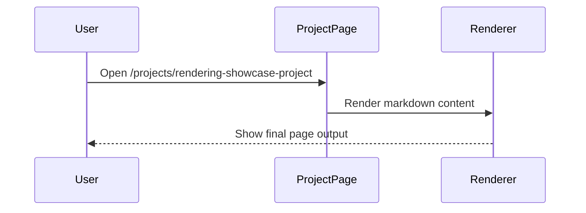

---
name: Rendering Showcase Project
description: A project detail page that demonstrates markdown rendering features in the projects module.
github: https://github.com/example/rendering-showcase-project
demo: https://example.com/rendering-showcase
date: 2026-02-18
tags:
  - showcase
  - project
  - rendering
techStack:
  - name: Next.js
  - name: TypeScript
  - name: Tailwind CSS
  - name: Mermaid
---

## Purpose

This project page validates `/projects/[slug]` rendering behavior and content readability.

## Feature Matrix

| Feature | Supported |
| --- | --- |
| Code highlighting | Yes |
| Mermaid diagram | Yes |
| Math equation | Yes |
| Alert block | Yes |

## Code Example

```tsx
export function FeatureBadge({ label }: { label: string }) {
  return <span className="tag">{label}</span>;
}
```

## Mermaid Example



## Math

Inline: $a^2 + b^2 = c^2$

$$
f(x) = x^2 + 2x + 1
$$

## Alert

> [!NOTE]
> This block is used to verify alert rendering in project details.

## Quick Check

1. Open `/projects` and find this project card.
2. Open `/projects/rendering-showcase-project`.
3. Verify table, code block, Mermaid, math, and alert rendering.
